# projetoMySQL
projeto com conexão no MySql em C#. Aula de DS na Etec de Guarulhos.
  

  <h3>Primeira página é login. Se você não souber usuário e senha, dá ruim. Se souber, ele loga.</h3>
  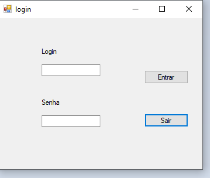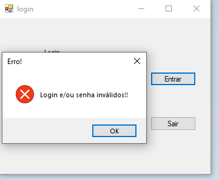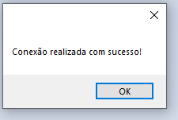

  

  <h3>Ele entra e aqui são as primeiras opções.</h3>
  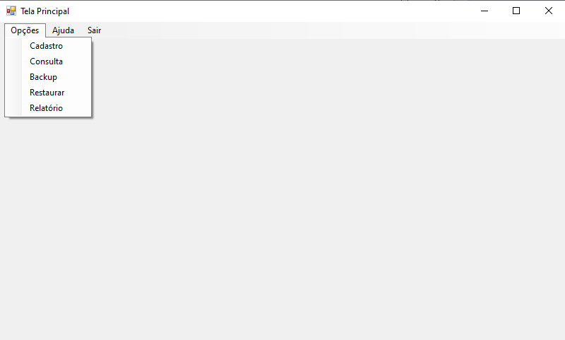

  

  <h3>Tela de cadastro.</h3>
  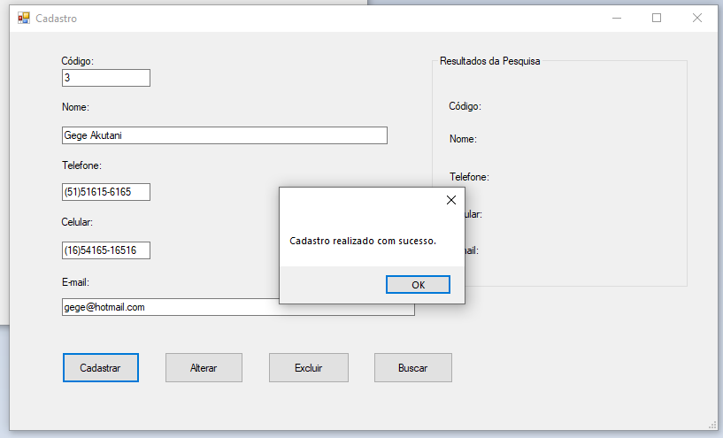

  

  <h3>Tela de consulta. Dá pra ver um registro específico ou todos.</h3>
  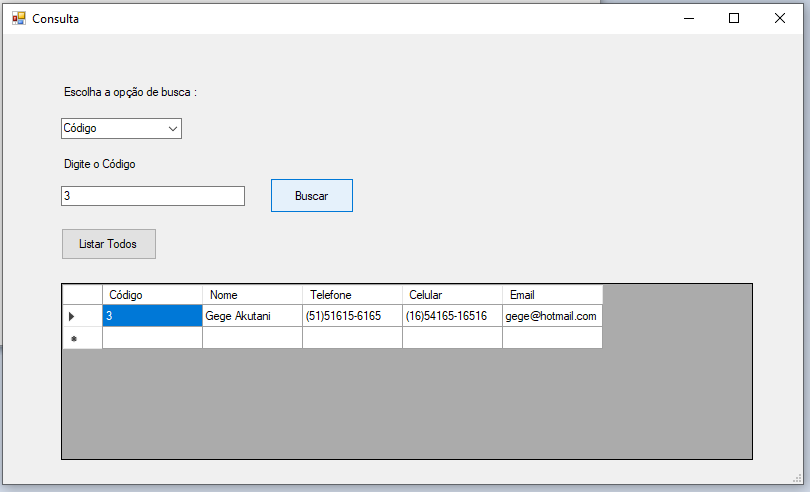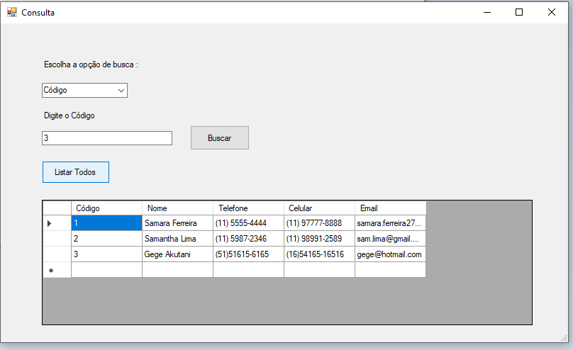

  

  <h3>Aqui abre um manual que é um pdf explicando as funcionalidade da aplicação.</h3>
  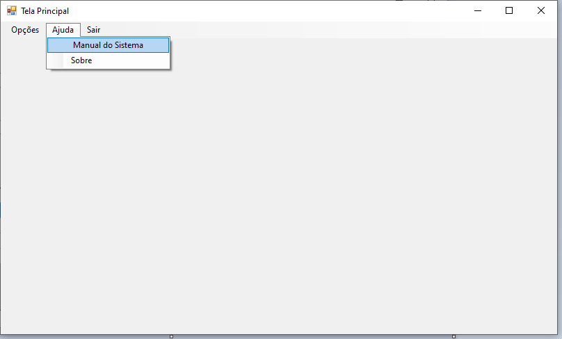 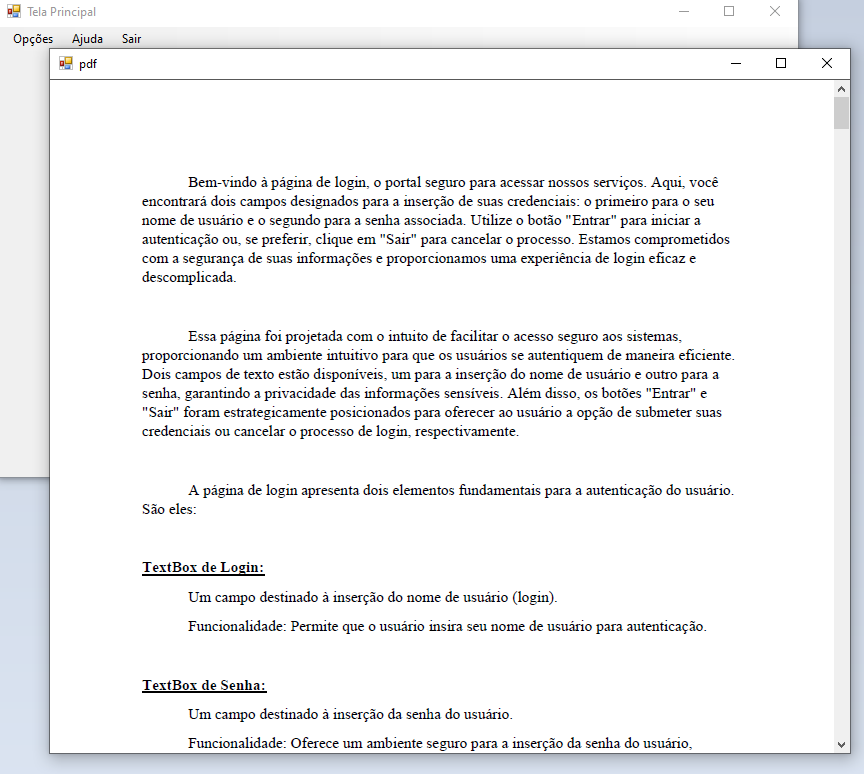

  

  <h3>Também tem a tela "Sobre".</h3>
  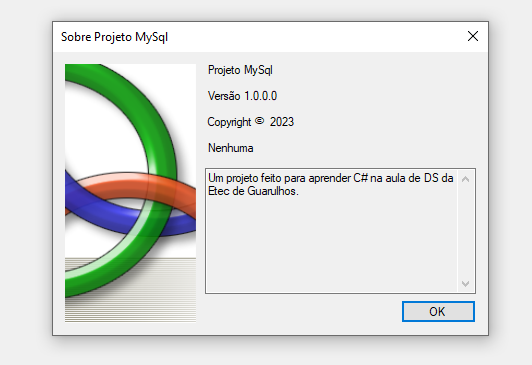

  

  <h3>Para terminar, o botão de sair.</h3>
  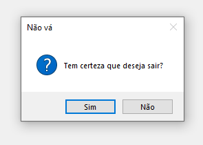

